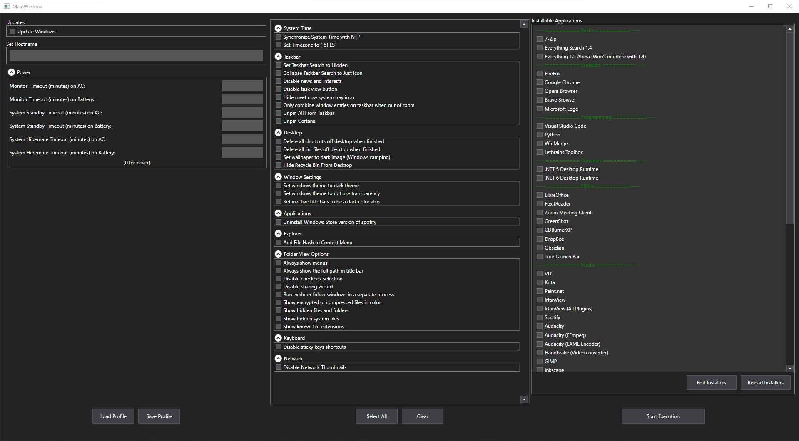

# Index

* [What it does](https://github.com/PockyBum522/windows-setup-assistant#what-it-does)
* [Features and Roadmap](https://github.com/PockyBum522/windows-setup-assistant#features-and-roadmap)
* [Prerequisites](https://github.com/PockyBum522/windows-setup-assistant#prerequisites)
* [Usage](https://github.com/PockyBum522/windows-setup-assistant#usage)
* [Objectives](https://github.com/PockyBum522/windows-setup-assistant#objectives)
* [Extensible Configuration - Installers](https://github.com/PockyBum522/windows-setup-assistant#extensible-configuration---installers)
* [Extensible Configuration - Windows Settings](https://github.com/PockyBum522/windows-setup-assistant#extensible-configuration---windows-settings)
* [Extensible Configuration - Powershell Scripts](https://github.com/PockyBum522/windows-setup-assistant#extensible-configuration---powershell-scripts)

* [Detailed Breakdown of What's Going On in the Batch File Bootstrapper](https://github.com/PockyBum522/windows-setup-assistant#detailed-breakdown-of-whats-going-on-in-the-batch-file-bootstrapper)
* [Detailed Breakdown of What's Going On in the Main Application](https://github.com/PockyBum522/windows-setup-assistant#detailed-breakdown-of-whats-going-on-in-the-main-application)
* [Helping With Development](https://github.com/PockyBum522/windows-setup-assistant#helping-with-development)
* [Why didn't you just...?](https://github.com/PockyBum522/windows-setup-assistant#why-didnt-you-just)

# Windows Setup Assistant

### What it does

Takes the pain out of new Windows 10 installations, by installing new software and configuring settings for you, all unattended.

You should be able to:
1. Install Windows 10 on a computer
2. Connect to the internet
3. Run the bootstrapper batch file
4. Spend about 5 minutes waiting for the initial requirement applications and libraries to load
5. Answer a few questions about how you want your system configured, or load a profile you made previously with all that information
6. Walk away

In about an hour, depending on your internet speed and system speed, you should reurn to find that:

* Your new Windows install has all settings set how you like them
* Your Windows install is completely up to date (If you selected the "Update Windows" option)
* Any applications you selected for install are now ready
* Any necessary reboots are handled automatically, with the program resuming on next boot.
* Your computer has been renamed to your chosen hostname

Through the optional use of AutoLogon64 from Microsoft SysInternals, which the bootstrapper script will set up for you, you can make the whole process happen completely unattended. If you have security concerns, you can simply type in the user's password each time the script needs to reboot and resume. Temporarily disabling UAC is also completely optional, though you will need to do both to make the process unattended.

# Features and Roadmap

* See also: [Objectives](https://github.com/PockyBum522/windows-setup-assistant#objectives)

* 100% tested and working settings for all Windows settings checkboxes - Almost!
* Basic application installation - Complete!
* Unattended Application Installation/Settings Apply/Windows Update with reboots - Complete! 
* Profile load/save - Complete!
* GUI - Complete!
* windows Settings - Complete!
* End-user easily customizable additional windows settings - Complete!
* End-user easily customizable application installs - Complete!

We are aiming to add more settings as the project progresses. We are still in the early stages of setting this up and making something that should be useful to everyone. Your help and pull requests are gratefully welcome!

# Prerequisites

* A Windows 10 installation that is not configured with your preferred settings or applications.

* A user account on said machine with administrator priveleges

* Internet on said machine

# Usage

For the end user, there are a few things you should know:

First off, if you just want to try it, download the latest release and then just double click "RUN ME FIRST (BOOTSTRAPPER).bat"

This will set up a few things necessary for unattended install, like prompting you to disable UAC prompts (You can re-enable them after the application is finished configuring your computer) and setting up Automatic Logon to your user with Microsoft's AutoLogon. (You can disable it after the install by running sysinternals autologon again. Both of these steps are optional, but required for a fully unattended process)

After the batch file runs, it should build the main application with the latest .NET 7 SDK, which will be installed automatically. 

Once you see the main window:

 
You are ready to go. Pick what applications you'd like to have installed, and what settings you would like to have applied, and click "Save Profile" if you'd like to re-use the current selections again in the future. 

When finished, click "Start Execution" and then you can sit back and relax or walk away. Everything from here on out will be taken care of without user interaction.

If you have chosen to install standard .exe or .msi installers, they will be saved for the last part of the process, so that everything else can happen unattended.

# Objectives 

### Short-Term

* Better progress indication. Right now a lot of things happen invisibly. Not great.

* Move work to be async, although that will mean needing to disable changes to the Main Window controls during the process. Not a big deal, though.

* Application settings would be nice to be able to be set, not just Windows settings - This will be more difficult to set up since I can't just index .reg files for some of those

* Better logging and failure recovery

* Considering: Integration of AutoHotKey scripts for attended installers automation as well as changing settings

* Making desktop and start menu shortcuts if specified for PortableApplicationInstaller and ArchiveInstaller.

### Long-Term

* Windows 11 Support (Has not yet been tested at all)

# Extensible Configuration - Installers

Users can add their own application installs that will show up in the "Install Applications" list. 

Simply browse to \WindowsSetupAssistant\Resources\Configuration\ and edit the "Available Installs.json" file.

There are four types of installations you can add here:

* ChocolateyInstaller
* ExecutableInstaller
* ArchiveInstaller
* PortableApplicationInstaller

I would suggest copying and pasting an existing entry of the type that you want to add, and then editing the values to suit your needs.

### ChocolateyInstaller:

Properties:

* ChocolateyId

This should be set to whatever comes after "choco install" on [Chocolatey Packages](https://community.chocolatey.org/packages) so for "Adobe AIR runtime, for example, you see: choco install adobeair"

So set ChocolateyId to just adobeair

* Arguments 

If you need to pass arguments to the "choco install" command that gets run, put them in here.

* Parameters

Same thing as arguments

* DisplayName 

This is what shows up in the list of applications that can be selected in the main window.

* IsSelected

Used for tracking if the user has selected the entry for install. You can set this to true if you want the application to always launch with this entry selected, but most likely, profiles will help you accomplish what you're trying to do much more easily. 

### ExecutableInstaller:

Properties:

* FileName

This should be the full filename of the exe or msi to start. It should be located in \windows-setup-assistant\WindowsSetupAssistant\Resources\Installers\Installer Executables\

* Arguments 

If you need to pass arguments to the start process command that runs the installer, pass them here.

* AutoHotkeyMacro

Unused at this time.

* DisplayName 

This is what shows up in the list of applications that can be selected in the main window.

* IsSelected

Used for tracking if the user has selected the entry for install. You can set this to true if you want the application to always launch with this entry selected, but most likely, profiles will help you accomplish what you're trying to do much more easily. 

### ArchiveInstaller:

Properties:

* ArchiveFilename

This should be the full filename of the .7z or .zip to extract. It should be located in \windows-setup-assistant\WindowsSetupAssistant\Resources\Installers\Installer Archives\

* DestinationPath 

Where you would like to have the archive extracted to. This folder will be created automatically. \ characters must be escaped. A valid path would look like this:

"DestinationPath": "C:\\PortableApplications\\Arduino IDE\\",

* DisplayName 

This is what shows up in the list of applications that can be selected in the main window.

* IsSelected

Used for tracking if the user has selected the entry for install. You can set this to true if you want the application to always launch with this entry selected, but most likely, profiles will help you accomplish what you're trying to do much more easily. 

### PortableApplicationInstaller:

Properties:

* FolderName

This should be the full folder name of the folder to copy. It should be located in \windows-setup-assistant\WindowsSetupAssistant\Resources\Installers\Portable Applications\ 

* DestinationPath 

Where you would like to have the folder copied to. \ characters must be escaped. A valid path would look like this:

"DestinationPath": "C:\\PortableApplications\\Arduino IDE\\",

* DisplayName 

This is what shows up in the list of applications that can be selected in the main window.

* IsSelected

Used for tracking if the user has selected the entry for install. You can set this to true if you want the application to always launch with this entry selected, but most likely, profiles will help you accomplish what you're trying to do much more easily. 

* DesktopShortcutExePath 

Unused for now, this will later allow you to specify an .exe to make a shortcut to that will show up on your desktop.

* StartMenuShortcutExePath

Unused for now, this will later allow you to specify an .exe to make a shortcut to that will show up on your desktop.

# Extensible Configuration - Windows Settings

Some of the setting changes are built into the program itself. These are added to the main window in \WindowsSetupAssistant.UI\WindowResources\MainWindow\SettingSections\

However, end users can easily add additional settings change functionality in the form of standard Windows registry files. To do so, simply add your .reg files under \WindowsSetupAssistant\Resources\Configuration\Registry Files\XYZ\Example Setting.reg

Right now there can only be one level deeper than the "Registry Files" folder. (In the above example, XYZ)

If the folder name in the "Registry Files" folder (XYZ above) matches an existing header in panel in main window, then the registry file will show up as a selectable option in that panel. The name of the option will be the registry file's name (Without the .reg extension)

If no section matches the folder name, a new section will be created in the main window and the registry file name (Minus the .reg extension) will show up in that new panel/section. 

# Extensible Configuration - Powershell Scripts

End users can easily add additional settings change functionality in the form of standard *.ps1 (Powershell script) files. To do so, simply add your .ps1 files under \WindowsSetupAssistant\Resources\Configuration\Powershell Scripts\XYZ\Example Setting.ps1

Right now there can only be one level deeper than the "Powershell Scripts" folder. (In the above example, XYZ)

If the folder name in the "Powershell Scripts" folder (XYZ above) matches an existing header in panel in main window, then the script will show up as a selectable option in that panel. The name of the option will be the script's name (Without the .ps1 extension)

If no section matches the folder name, a new section will be created in the main window and the script name (Minus the .ps1 extension) will show up in that new panel/section. 

[Windows 10 Debloater](https://github.com/Sycnex/Windows10Debloater) has been included as an example

Scripts will be run as admin, and execution policy will be set to disabled temporarily just for the script. (It won't affect system powershell execution policy)

# Detailed Breakdown of What's Going On in the Batch File Bootstrapper

When you double click on "RUN ME FIRST (BOOTSTRAPPER).bat" a few things happen:

* The batch file creates a .lockfile in C:\Users\Public\Documents\ so that the second half of the script (the second half runs as the user) waits until after the first half (first half runs as admin because Chocolatey needs it) has finished to allow the second half (non-admin) part to proceed.

* The batch file checks if you have an internet connection, exits if you don't.

* The batch file checks if you ran it as admin, exits if you DID. 

(This is because while it's easy to elevate the process later, it's suprisingly hard to figure out what user originally ran the batch file if it's started as administrator by them when they run it.)

* The batch file then notifies the user they should disable UAC prompts and set up AutoLogin. 

This is for unattended capability, both of these things can be re-enabled/disabled once the application finishes running and the computer reboots for the last time. Both of these are optional, but required for the whole process being unattended.

* The batch file then installs Chocolatey, which we'll be using to install things

* The batch file installs the latest .NET SDK so we can build this application

* The batch file then installs powershell core and Notepad++ just to give some basic utilities to make troubleshooting easier.

* The admin half (first half) of the batch file now deletes the .lockfile and closes. 

Once the second half sees that the lockfile is gone, it knows everything it needs has been installed and it can proceed. 

* The first half does some basic nuget cleaning, restores the packages in the project, and then builds and runs the application.

# Detailed Breakdown of What's Going On in the Main Application

* When you make your selections and hit "Start Execution" the application immediately saves all of the slections to a JSON file stored in C:\Users\Public\Documents\ so that it can act on them later.

* It also creates a batch file in the Public Startup folder to re-run the application on subsequent reboots. 

This is deleted once the application has run through its complete process.

* If you selected to update windows, a CLI windows update handler will be installed, and windows will be updated as far as it will allow without a reboot. 

* The application then updates the JSON file in C:\Users\Public\Documents\ and saves what stage of the installation process/that it has gotten through the first stage

* When the computer is done rebooting to apply the windows updates, the batch file in the public startup folder launches, and re-runs the application.

* Upon re-launch, the application checks the settings it saved at the beginning, and what stage of the process it's on. 

It does any necessary work, and then if necessary, updates the stage and reboots the computer. The first few reboots are just to install windows updates, reboot, then see if there are any more updates and install them. This only happens if you checked the "Update Windows" checkbox.

* Once it's done updating windows, it will start installing selected applications. It handles all the selected 
ChocolateyInstallers, ArchiveInstallers, and PortableApplicationInstallers first, since those don't require user interaction. Once those are finished, it runs all ExecutableInstallers.

It will then load a warning dialog telling you to proceed through any user-interactive ExecutableInstallers that may be on the screen, then once you are finished, press yes to reboot the computer.

This is the last reboot, and at this point the process is finished. The application will clean up the files it was using to save the current stage of the process it was in, which are: The JSON file with stage info and the user options that were selected at the beginning, and the bat file in Public Startup.

# Helping With Development

So you read through all that? I'm impressed. Maybe a little frightened. I'm hesitant to put a lot of effort into this section at such an early stage of development, as things will likely change quickly.

However! Know that help and pull requests are GREATLY appreciated and I will review them in a timely manner.

For now, there's several things that would be helpful until I get a better idea of the structure of the code:

* Windows Settings

If you want a setting added and can get a .reg file or C# code to do what you want, send it over!

* New Installs

If you add to the "Available Installers.json" with something that you think other people will find useful, make a pull request! I probably won't approve all of them, but if you tell me why you think it should be included, I likely will!

For security reasons, I don't accept ArchiveInstallers or PortableAppsInstallers unless you can tell me where to download the thing on a well-known 3rd party website, and then give me the configuration for it. I will still likely scrutinize the heck out of it.

* Crash/Bug Reports

Log files are located in C:\Users\Public\Documents\Logs\

Please add an issue in github with the log and expected behavior. Logs shouldn't contain sensitive data (Possibly your username.) and if they do, let me know, so I can tell it to stop logging it.

* Code Review

I am self taught, and in addition to that, I don't know what I don't know.

If you see a better way to do something, or structure things, or anything, please talk to me about it. File an issue and use the "question" tag. I would love to have a conversation with you!

* Security Review

See above. I don't know what I don't know. 

The good news is this application isn't running on the open internet, it's running on your local machine. It also does not phone home or connect to anywhere other than chocolatey's servers/whatever servers the chocolatey installs pull from. The bad news is it needs admin priveleges for a lot of the process. Protect your configuration files. Nasty stuff could be replicated on any machines that you use this on should something get compromised. However, the same holds true if you were just carrying around a thumbdrive with a bunch of .exe's to install and one of those became compromised. Also, fair warning, some of the preconfigured chocolatey installs are community packages. Update those to be only official packages if you want better security checks on that side.

# Why didn't you just...?

Use group policy?

Use ninite? (I love ninite. Great product. I used the paid version for a long while.)

Use X, Y, or Z?

(Sysprep? You think your mother could use sysprep easily?)

Mostly because I wanted to make something that's useful and usable by everyone! I wanted it to be simple to configure, powerful enough to be useful, and help real people save time. Since this application just pops up a window asking you what you'd like to install or configure, that seems pretty simple to me! 

Up to this point, I have done lots of research and have never been able to find something that will let you do Windows settings, application installs, and custom configuration of those things all in one place. This aims to fix that.
